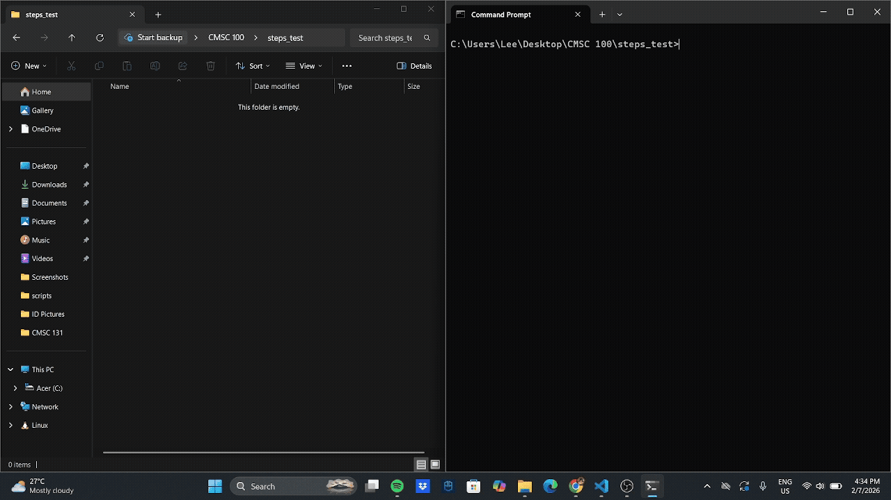
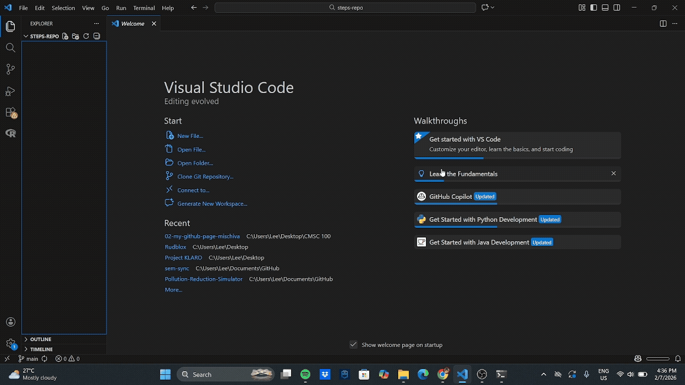
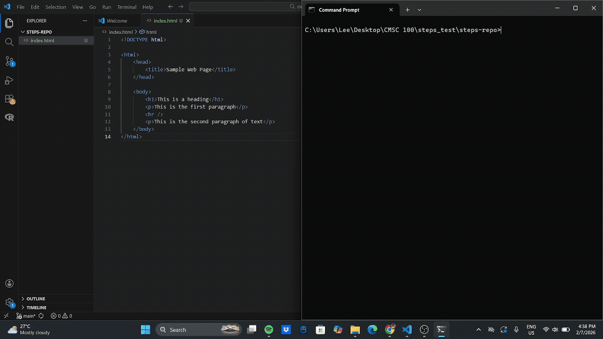
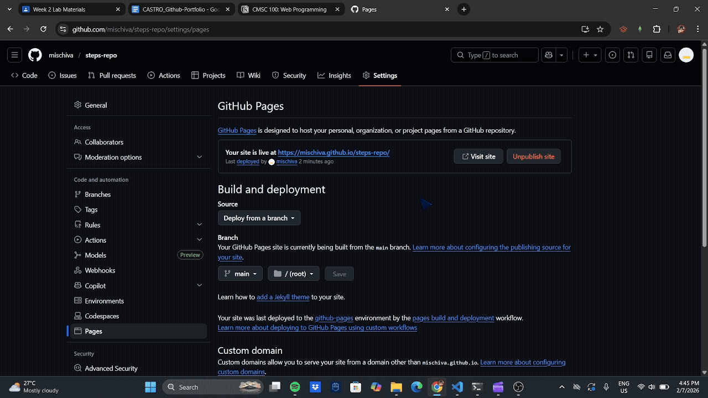

# Exercise 2: My GitHub Portfolio 🫦🤟

## 🕵️‍♂️ About Me 🕵️‍♂️
*Name:* Allane Lee Castro  
*Degree Program:* BS Computer Science  
*Live website link:* [Click here](https://cmsc100-laboratory.github.io/02-my-github-page-mischiva/)

## Steps on How to Create a GitHub Page 🤓👆

### Step 1: Create a Repository
Create a **new repository** on GitHub. Make sure it is **public**, as free GitHub accounts only allow GitHub Pages to run on public repositories.  

Clone it to your local machine using:
`git clone (link)`

> [!NOTE]
> Make sure you are logged in on your machine before cloning. Otherwise, the command may fail.

---

### Step 2: Create Your `index.html`
Create an `index.html` file in your repository with the content you want to display on your GitHub Page.  

> [!TIP]
> You can start with a simple "Hello World" HTML page if you’re new to HTML.

---

### Step 3: Stage, Commit, and Push Changes
After creating your `index.html`, push your changes to GitHub using:

`git add index.html`
`git commit -m "docs: add initial index.html"`
`git push origin main`

> [!IMPORTANT]
> Replace `main` with your branch name if your default branch is different.

---

### Step 4: Enable GitHub Pages
1. Go to **Settings** in your repository.  
2. Make sure the repository is **public**.  
3. Navigate to **Pages** on the left menu.  
4. Under **Build and deployment**, select the branch you want to publish (usually `main`) and click **Save**.  

> [!WARNING]
> GitHub Pages only works on public repositories for free accounts. Ensure your repository is public to avoid deployment issues.

---

### Step 5: Access Your GitHub Page
Wait a few minutes and refresh the page. GitHub will generate a **link** that takes you to your live website.  

> [!CAUTION]
> It can take a few minutes for the page to appear. Do not refresh repeatedly to avoid confusing delays.

---

## 😍🥰 Want to Explore My References? 😜😇
[Visit this link](https://docs.google.com/document/d/1ytpPDMQ0X5AU3UxrWZh09sIM5quMHXahTicZmlEVrKc/edit?usp=sharing)
